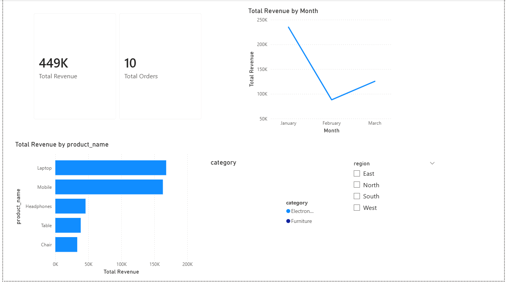
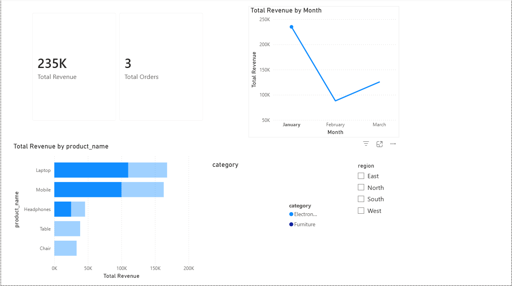
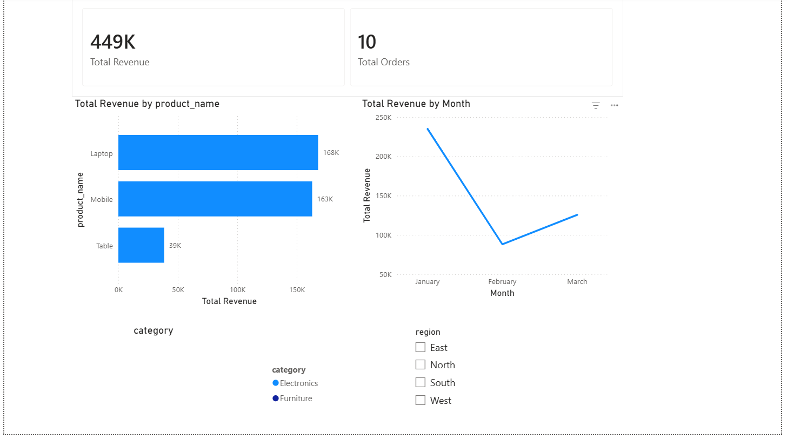

# 📊 Sales Performance Dashboard

## 📌 Project Overview
This project analyzes sales data to identify monthly trends, top-performing products, and regional performance using SQL Server and Power BI.

## 🛠 Tools Used
- SQL Server (SSMS)
- Excel (Data review)
- Power BI (Dashboard & Visualization)

## 📂 Dataset
- Simulated sales dataset (CSV)
- Fields: Order Date, Product, Category, Region, Quantity, Unit Price

## 📈 Analysis Performed
- Total revenue calculation
- Monthly sales trend analysis
- Product, category, and region-wise performance

## 📊 Dashboard Preview
### Overall Dashboard

### Monthly Sales Trend

### Top Products

## 🔍 Key Insights
- Electronics category generated the highest revenue
- Laptops are the top-performing product
- South and North regions contribute the most sales
- Sales peak observed in March

## 👤 Author
**Siva Krishnaprasad Paladugu**  
Fresher Data Analyst (SQL Server & Power BI)

